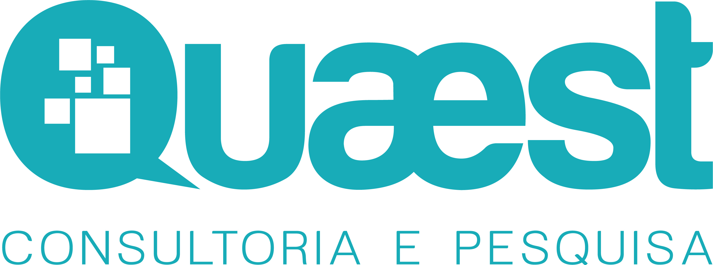

```{r setup, include=FALSE}
# Opts
knitr::opts_chunk$set(echo = FALSE, 
                      warning = FALSE, 
                      message = FALSE, 
                      fig.width = 7.5, 
                      fig.height = 4.5, 
                      fig.align = "center",
                      dev = "svg")

# Pacotes
library(echarts4r)
library(htmltools)
library(reactable)
library(tidyverse)
library(showtext)
library(here)
library(dplyr)
library(here)
library(readxl)
library(ggplot2)
library(rio)
library(quaestplots)
library(openxlsx)
library(gridExtra)
library(grid)
library(knitr)

# Fontes
font_add_google("Montserrat", "montserrat", regular.wt = 300, bold.wt = 900)
showtext_auto()

# Dicionário
dicio <- c("https", "para", "mais", "pelo","foram", "pela","entre",
           "como", "feira", "link", "segue", "hoje", "também", "todo", "toda",
           "todos", "todas", "serão", "será", "aquele", "aquela",
           "está", "estão", "sobre", "muito", "isso", "essa", "esse",
           "quem", "aqui", "anos", "minha", "pode", "porque", "pois", "quando","antes", "depois", 
           "contra", "desde", "como", "depois", "foto", "agora", "fazer", "sempre",
           "muito", "muita", "muitos", "muitas", "amanhã", "hoje", "ontem", "semana",
           "eles", "elas", "coisa", "tipo", "quer", "cada", "outro", "tudo", "nada",
           "meus", "mesmo", "nesse", "nessa", "nisso", "ninguém", "dias", "fotos", "gente",
           "milhões", "bilhão", "milhão", "bilhões", "dezena", "dezenas", "centena",
           "centenas", "nesta", "neste", "nisto", "qual", "quais", "qualquer", "quaisquer",
           "seus", "suas", "teus", "tuas", "esta", "este", "estas", "estes", "isto",
           "nosso", "nossa", "você", "vocês", "vamos", "ainda", "logo", "onde", "aonde",
           "sabe", "nunca", "sempre", "novo", "novos", "nova", "novas", "além", "partir")

#


```

```{css, eval=TRUE}
/* Fontes */
@import url('https://fonts.googleapis.com/css?family=Montserrat:300,400');
@import url('https://fonts.googleapis.com/css?family=Poppins:400,700&display=swap');


/* Titulos */
h1, .h1 {
    font-family: Poppins,"Helvetica Neue",Helvetica,Arial,sans-serif;
    line-height: 1.2;
    color:#0098a0;
    font-weight: 700;
    font-size: 26px;
}

h1.title {
    font-size: 44;
}

h2, h3, .h2, .h3 {
    font-family: Montserrat,"Helvetica Neue",Helvetica,Arial,sans-serif;
    color: inherit;
    font-weight: 300;
    line-height: normal;
    padding-top: 17px;
}

h2, .h2 {
    font-family: Poppins,"Helvetica Neue",Helvetica,Arial,sans-serif;
    font-weight: 700;
    color:#0098a0;
    font-size: 19px;
}

h3, .h3 {
    font-family: Poppins,"Helvetica Neue",Helvetica,Arial,sans-serif;
    font-weight: 700;
    color: #0098a0;
    font-size: 16px;
}

h3.subtitle, .h3.subtitle {
    font-size: 23px;
    padding-bottom: 17px;
    font-weight: 300;
    color: #333333;
    font-family: Montserrat,"Helvetica Neue",Helvetica,Arial,sans-serif;
}

h4.author, .h4.author {
    font-family: Montserrat,"Helvetica Neue",Helvetica,Arial,sans-serif;
    color: inherit;
    font-weight: 400;
    font-size: 19px;
}


h4, .h4 {
    font-family: Poppins,"Helvetica Neue",Helvetica,Arial,sans-serif;
    font-weight: 400;
    color:#0098a0;
    font-size: 17px;
}


h5, .h5 {
    font-family: Poppins,"Helvetica Neue",Helvetica,Arial,sans-serif;
    font-weight: 400;
    font-size: 18px;
    color:#0098a0;
    padding-top: 12px;
}

h6, .h6 {
    font-family: Montserrat,"Helvetica Neue",Helvetica,Arial,sans-serif;
    font-weight: 300;
    font-size: 14px;
    color: #666666;
}


/* Links */
a {
  color:#0098a0;
  text-decoration:none;
  transition: all 0.4s ease-out;
   -webkit-transition: all 0.4s ease-out;
   -moz-transition: all 0.4s ease-out;
   -o-transition: all 0.4s ease-out;
   -ms-transition: all 0.4s ease-out;
}

a:visited {
  color:#0098a0;
  text-decoration:none;
  
}

a:hover {
  color:#00c9d4;
}


/* Corpo e itens */
body {
    font-family: Montserrat, Georgia,"Times New Roman",Times,serif;
    font-size: 19px;
    font-weight: 400;
    background-color: #ecf0f2;
}

ul, ol {
    color: #333333;
}


/* Tabelas React */
.ReactTable {
    height: 100%;
    background: #ecf0f2;
}

.html-widget {
    font-size: 17px;
}

.rt-thead {
    font-weight: 400;
}

.ReactTable.-highlight .rt-tbody .rt-tr:not(.-padRow):hover {
    background: #ced8dd;
}

.ReactTable .rt-thead .rt-tr {
    border-bottom: 1px solid #555555;
}


/* Nav pills */

.nav-pills>li>a {
    border-radius: 4px;
    background-color: #0098a0;
    color: #FAFAFA;
}

.nav>li>a {
    position: relative;
    display: block;
    padding: 3px 7px;
}

.nav-pills>li>a, .nav-pills>li>a:hover, .nav-pills>li>a:focus {
    color: #ffffff;
    background-color: #a3b8c1;
}

.nav-pills>li.active>a, .nav-pills>li.active>a:hover, .nav-pills>li.active>a:focus {
    color: #ffffff;
    background-color: #0098a0;
}
  
.nav {
    padding-top: 15px;
}
```


<br>

# Introdução e Motivação 

Que as redes sociais viraram um mecanismo fundamental para a divulgação de ideias políticas todo mundo já sabe. Agora, será que é possível <u>entender as prioridades</u>, ou ao menos <u>traçar um perfil</u>, de políticos ao estudarmos a linguagem que eles utilizam em suas redes? Foi a partir desse questionamento que a Quaest estudou quais foram as <u>palavras mais utilizadas</u> pelos candidatos com maiores intenções de voto para a presidência e alguns Governadores bem populares no Twitter ao longo de todo o ano de 2021, a fim de responder essas dúvidas.

Para isso, escolhemos os cinco candidatos mais preferidos pela população segundo a última pesquisa Genial/Quaest, publicada no início de Janeiro. Foram eles: <b>Lula, Bolsonaro, Sergio Moro, Ciro Gomes e João Doria</b>. Além disso, foram escolhidos seis Governadores com IPDs bem altos: <b>Camilo Santana, Cláudio Castro, Eduardo Leite, Flávio Dino, João Doria e Romeu Zema</b>. A partir dessa seleção, buscamos todos os Tweets realizados por estes perfis a fim de realizar nossa análise.

# Método de Análise

A fim de analisar quais as palavras mais utilizadas nas redes, definimos algumas regras de termos que não passarão pelo filtro de seleção. Esse filtro tem como objetivo retirar termos que de nada agregam a análise. Foram retirados, portanto:

<ol>
  <li>Palavras irrelevantes com menos de 3 letras</li>
  <li>Preposições</li>
  <li>Advérbios</li>
  <li>Números</li>
  <li>Links</li>
  <li>Pronomes</li>
  <li>Certas hashtags</li>
  <li>Marcações de outros perfis</li>
</ol>

Após essa seleção, ainda filtramos palavras que foram utilizadas mais de uma vez em cada perfil para retirarmos termos outliners que não fazem parte do discurso recorrente dos políticos.

Com isso, conseguimos criar uma tabela para cada um dos políticos analisados com as palavras mais utilizadas ao longo de todo o ano. Abaixo, é possível verificar um aperitivo dos termos mais utilizados por alguns políticos, escolhidos aleatoriamente:

<center>
```{r}
# Moro
bd_moro <- read_xlsx(here("2.documentos/pres/outputs/palavras_moro.xlsx"))
colnames(bd_moro) <- c("Top-5 Palavras Sergio Moro", "Frequência")
bd_moro <- head(bd_moro, n = 5)

reactable(bd_moro, highlight = TRUE, compact = TRUE, 
          showPageInfo = TRUE, width = 300)

# Zema
bd_zema <- read_xlsx(here("2.documentos/govs/outputs/palavras_zema.xlsx"))
colnames(bd_zema) <- c("Top-5 Palavras Romeu Zema", "Frequência")
bd_zema <- head(bd_zema, n = 5, width = 250)

reactable(bd_zema, highlight = TRUE, compact = TRUE, 
          showPageInfo = TRUE, width = 300)
```
</center>

# Resultados Gerais
## Resultados Iniciais

Logo de cara já é possível observarmos quais foram os políticos mais presentes no Twitter no período analisado. O campeão de publicações, por parte dos Presidenciáveis, foi <u>Ciro Gomes, com 2.657 posts, seguido de João Doria com 2.602, Bolsonaro com 1.877, Lula com 1.752 e Sergio Moro com 248</u>.

Já pelos Governadores, a liderança ficou com <u>João Doria com 2.602 posts, seguido de Camilo Santana com 2.461, Flávio Dino com 2.203, Eduardo Leite com 1.577, Cláudio Castro com 885 e Romeu Zema com 786</u>.

## Apresentação dos Resultados Gerais

Antes de partirmos para uma anáise individual de cada um dos 10 perfis selecionados, vamos apresentar os resultados gerais da análise. 

Na imagem abaixo é possível conferir um agregado das 10 palavras mais utilizadas por cada um dos Presidenciáveis e quantas vezes elas foram publicadas:

## Presidenciáveis

<center>

</center>
<br>

# Análises Individuais
Nesta seção, buscaremos mostrar que, a partir de uma análise individual dos termos mais utilizados por cada perfil, é possível <u>traçar um perfil de cada político</u> e que, muitas vezes, este perfil vai ao encontro da percepção da população sobre aquela figura.

## Lula

É possível ver que Lula prioriza posts feitos na 3ª pessoa, fato esse evidenciado pelo seu nome ser a palavra mais utilizada. Além disso, os termos <b>“povo”</b> e <b>“pessoas”</b> estarem no Top-10 também não surpreende, já que o ex-Presidente procura fazer uma campanha agregadora e bastante comunicativa com diversos setores da política e da sociedade. Outro ponto importante é a presença de <b>“bolsonaro”</b> e <b>“pt”</b> na lista, mostrando a constante crítica ao atual Presidente e uma fidelidade partidária bastante forte do candidato.

<br>
<center>

</center>

## Bolsonaro

Já para Bolsonaro, seu Top-10 demonstra outras preocupações. A pandemia ainda é uma pedra muito grande em seu sapato, como mostrado pelos termos <b>“doses”</b>, <b>“covid”</b> e <b>“vacinas”</b> estarem nas palavras mais utilizadas. Outro destaque é o termo <b>“estados”</b> na 5ª colocação, algo bastante em linha com o discurso do Presidente de oposição às posições tomadas pelos estados no combate à pandemia. Como seu discurso também se preocupa com as narrativas e com os dados apresentados, seja sobre o vírus, seja sobre seu governo, também não espanta <b>“informações”</b> estar no topo do ranking.

<br>
<center>

</center>

## Sergio Moro

O perfil de Sergio Moro, mesmo sendo o menos ativo no Twitter, também traz confirmações importantes. Já era de se esperar que <b>“corrupção”</b> fosse a palavra mais publicada. Vale ressaltar que <b>“lava”</b> e <b>“jato”</b> também estão no Top-10 se referindo a operação constantemente citada pelo candidato e <b>“combate”</b> também tendo relação a tal temática. Seu perfil parece ser bastante pessoal, com termos como <b>“podemos”</b> e <b>“livro”</b> no topo, tendo relação ao partido que o ex-juiz se filiou e ao livro de memórias que o próprio lançou no final do ano. Portanto, suas palavras mais utilizadas confirmam sua principal preocupação sendo a corrupção - algo importante para sua campanha, uma vez que, <u>como já demonstrado previamente em pesquisas Genial/Quaest</u>, sua atuação nessa campo é um dos motivos principais para seus eleitores o escolherem como opção de voto.

<br>
<center>

</center>

## Ciro Gomes

Ciro Gomes segue uma linha bem clara ao observarmos seus termos mais utilizados. O primeiro destaque vai para <b>“bolsonaro”</b> com 660 vezes sendo dito em seus tweets. Isso dá uma citação ao atual presidente a cada quatro posts do candidato. Um número bem grande, mas em linha com a oposição feita por ele. Além disso, temos <b>“turma”</b> e <b>“projeto”</b> que estão ligados, respectivamente, ao apelido dado por Ciro a seus seguidores (Turma Boa) e a seu livro / ideal sobre o Projeto Nacional Desenvolvimentista, que é seu principal conjunto de ideias sobre o Brasil. Ciro Gomes parece focar, portanto, em suas ideias e em seus apoiadores ao mesmo tempo que foca suas críticas em Bolsonaro.

<br>
<center>

</center>

## João Doria

Também sem muitas surpresas, o foco do perfil de João Doria está bastante em linha com suas ações e recentes vitórias políticas: a vacinação. Os termos <b>“vacinar”</b>, <b>“vacina”</b>, <b>“doses”</b> e <b>“vida”</b> estão no Top-10 e confirmam que seu principal objetivo, tanto de divulgação quanto de atuação, está relacionado ao combate a pandemia, já que o Governador foi uma das figuras mais importantes na compra e distribuição de vacinas no ano de 2021. Além disso, <b>“paulo”</b> aparece em 3º lugar por conta dos vários tweets referentes a São Paulo e a presença de <b>“butantan”</b> no ranking confirma a parceria e defesa feita por Doria a esse instituto fundamental.

<br>
<center>

</center>

## Conclusão - Análises Presidenciáveis:

Com todas essas análises individuais provamos uma observação importante: não só é possível <u>traçar um perfil</u> de cada político a partir das palavras mais utilizadas nas redes sociais como estes agentes analisados estão com suas <u>campanhas bastante em linha com suas publicações</u>. O fato de existirem pouquíssimas surpresas entre as palavras mais ditas no Top-10 de cada um dos cinco candidatos a presidência confirma essa constatação, já que torna-se fácil <u>prever quais seriam os focos de cada um deles</u>.

<br>
# Agregação Temas Presidenciáveis
Nas pesquisas Genial/Quaest uma das perguntas mais recorrentes trata de entender qual é, na percepção dos entrevistados, o problema mais importante que o Brasil enfrenta. Para isso, as respostas dos entrevistados são <u>agregadas em diversos temas</u> mais globais a fim de simplificar as análises. 

A percepção da população, então, nós já sabemos. Mas será que é possível agregar as palavras utilizadas pelos Presidenciáveis para definir quais são seus <u>temas principais</u>?

## Economia

Começaremos analisando termos ligados a <b>Economia</b>, uma vez que <u>37% dos brasileiros indicam a Economia como principal problema do país na última pesquisa Genial/Quaest</u>. Para realizar tal agregação, agregamos a frequência de termos como <u>Inflação, Economia, Empregos, Desemprego</u>, entre outros:

<center>
```{r}
df1 <- data.frame(Presidenciáveis = c("Doria", "Ciro", "Bolsonaro", "Lula", "Moro"),
           Frequência = c("231", "214", "128", "98", "42"))

econ <- reactable(df1, highlight = TRUE, compact = TRUE, 
          showPageInfo = TRUE, width = 300)

div(class = "econ",
  div(class = "econ-header",
      div(class = "econ-title", "ECONOMIA"),
      econ
  )
)
```
</center>

É possível ver que João Doria e Ciro Gomes deram mais atenção para essa temática ao longo do ano de 2021. Esse resulta não é muito surpreendente, uma vez que <u>Doria é governador da maior economia estadual do Brasil e Ciro está constantemente tratando do desenvolvimento da economia brasileira</u>. A menor frequência desses termos nos tweets feitos por <u>Bolsonaro pode indicar uma dificuldade em lidar com a queda da produção e o alto desemprego no nosso país durante a pandemia</u>.

## Pandemia

Seguindo a ordem dos problemas principais indicados na última pesquisa Genial/Quaest temos a <b>Pandemia</b>. Os casos de Covid-19 em território brasileiro voltaram a preocupar a população com maior intensidade, uma vez que <u>28% da população indica a Pandemia como o maior problema do país</u>, um crescimento de 9 p.p. em relação à pesquisa de Dezembro. Nesta parte, agregamos termos como <u>Pandemia, Vírus, Corona, Covid</u>, entre outros.

<center>
```{r}
df2 <- data.frame(Presidenciáveis = c("Doria", "Bolsonaro", "Ciro", "Lula", "Moro"),
           Frequência = c("341", "224", "154", "90", "12"))

pand <- reactable(df2, highlight = TRUE, compact = TRUE, 
          showPageInfo = TRUE, width = 300)

div(class = "pand",
  div(class = "pand-header",
      div(class = "pand-title", "PANDEMIA"),
      pand
  )
)
```
</center>

Também sem muitas surpresas, Doria aparece com uma liderança folgada quando se trata de temas ligados a Pandemia. Como <u>João Doria está em constante divulgação das suas ações de combate à Pandemia</u> e mais especificamente a vacinação - como visto nas suas palavras mais utilizadas no geral, é compreensível sua larga vantagem. Porém, Bolsonaro surge em segundo lugar, mostrando que, mesmo em 2021, <u>a Pandemia ainda era algo que o Presidente precisava se preocupar</u>.

## Vacinação

Tema adjacente à Pandemia, é importante realizar uma análise de termos ligados a <b>Vacinação</b>. Para isso, agregamos termos como <u>Vacinas, Doses, Vacinados</u>, entre outros:

<center>
```{r}
df3 <- data.frame(Presidenciáveis = c("Doria", "Bolsonaro", "Ciro", "Lula", "Moro"),
           Frequência = c("1746", "328", "145", "126", "14"))

vacina <- reactable(df3, highlight = TRUE, compact = TRUE, 
          showPageInfo = TRUE, width = 300)

div(class = "vacina",
  div(class = "vacina-header",
      div(class = "vacina-title", "VACINAÇÃO"),
      vacina
  )
)
```
</center>

Quando tratamos da Vacinação, a tendência observada na análise da Pandemia é ainda mais ampliada. <u>João Doria aparece com 5 vezes mais publicações sobre o tema do que o segundo colocado, Bolsonaro</u>, evidenciando que este realmente foi o foco principal de seu governo e de sua campanha. Além disso, é válido ressaltar que Ciro e Lula tiveram uma frequência relativamente próxima nos dois temas, com Ciro tendo maior vantagem quando se trata de Pandemia. 

## Questões Sociais
Começaremos com <b>Questões Socias</b>. Para isso, buscamos quantas vezes termos como <u>Fome, Miséria, Pobreza e Desigualdade</u> foram publicadas por cada perfil:

<center>
```{r}
df4 <- data.frame(Presidenciáveis = c("Lula", "Ciro", "Doria", "Moro", "Bolsonaro"),
           Frequência = c("141", "128", "29", "9", "5"))

sociais <- reactable(df4, highlight = TRUE, compact = TRUE, 
          showPageInfo = TRUE, width = 300)

div(class = "sociais",
  div(class = "sociais-header",
      div(class = "sociais-title", "QUESTÕES SOCIAIS"),
      sociais
  )
)

```
</center>

Observamos que <u>Lula e Ciro possuem ampla vantagem</u> frente aos demais candidatos quando tratamos de Questões Sociais. Como visto na última <u>pesquisa Genial/Quaest, 13% da população enxerga as Questões Sociais como o principal problema do país</u>. Isso é uma grande sinalização de que o eleitorado está preocupado com esta temática, o que deve ligar um alerta nos candidatos para suas campanhas em 2022.

## Corrupção

Com <u>9% da população enxergando este como o maior problema do Brasil hoje</u>, agregamos termos como <u>Corrupto, Desvio, Lava Jato, Propina</u>, entre outros, a fim de tratar do tema da <b>Corrupção</b>:

<center>
```{r}
df5 <- data.frame(Presidenciáveis = c("Ciro", "Moro", "Lula", "Bolsonaro", "Doria"),
           Frequência = c("138", "72", "26", "15", "2"))

corrup <- reactable(df5, highlight = TRUE, compact = TRUE, 
          showPageInfo = TRUE, width = 300)

div(class = "corrup",
  div(class = "corrup-header",
      div(class = "corrup-title", "CORRUPÇÃO"),
      corrup
  )
)

```
</center>

<u>Ciro Gomes ficou com a liderança</u> nas citações sobre a Corrupção, seguido de Sergio
Moro com metade de sua frequência. Entretanto, é válido ressaltar que, como demonstrado no início deste relatório, Moro publicou 2400 tweets a menos que Ciro. Logo, <u>a distância entre eles só ocorre pois Moro é bem menos ativo no Twitter</u>. 

## Brasil

Como uma última análise, buscamos agregar palavras que remetem ao <b>Brasil</b>, ou, mais especificamente, a questão nacional. Os termos agregados para tal análise foram <u>Brasileiros, Federal, Nacional, Brasil</u>, entre outros:

<center>
```{r}
df6 <- data.frame(Presidenciáveis = c("Ciro", "Lula", "Doria", "Bolsonaro", "Moro"),
           Frequência = c("1722", "706", "699", "659", "91"))

brasil <- reactable(df6, highlight = TRUE, compact = TRUE, 
          showPageInfo = TRUE, width = 300)

div(class = "brasil",
  div(class = "brasil-header",
      div(class = "brasil-title", "BRASIL"),
      brasil
  )
)

```
</center>

A partir desta agregação, observamos que <u>Ciro Gomes parece ter o discurso mais nacionalizado</u> entre os Presidenciáveis, isto é, trata de assuntos nacionais e se volta para os brasileiros como um todo. É importante ressaltar essa intenção pois veremos, a seguir, que esta tendência é bem diferente de quando analisamos os discursos dos Governadores.

## Governadores

<center>

</center>

## Análise Governadores:

Diferentemente do que ocorre com os Presidenciáveis, os Governadores - com exceção de João Doria - não estão em campanha para um cargo a nível nacional. Isso traz algumas implicações importantes, no sentido dos termos serem bem mais regionais do que nacionais. 
Um exemplo disso é o fato do termo <b>"brasil"</b> ser unanimidade no Top-10 dos Presidenciáveis e aparecer com raridade entre os Governadores. Além disso, entre todos os Governadores há alguma menção direta ao <u>estado</u> destes políticos:

<ol>
  <li>Camilo Santana: <b>"ceará" e "cearenses"</b></li>
  <li>Cláudio Castro: <b>"rio", "janeiro" e "fluminense"</b></li>
  <li>Eduardo Leite: <b>"grande" e "sul"</b></li>
  <li>Flávio Dino: <b>"maranhão"</b></li>
  <li>João Doria: <b>"paulo"</b></li>
  <li>Romeu Zema: <b>"minas" e "mineiros"</b></li>
</ol>

Além dos termos estaduais, temos também um grande foco <u>à pandemia e a campanha de vacinação</u>:

<ol>
  <li>Camilo Santana: <b>"saúde", "doses", "covid", "vacinas" e "pandemia"</b></li>
  <li>Cláudio Castro: <b>"covid"</b></li>
  <li>Eduardo Leite: <b>"pandemia"</b></li>
  <li>Flávio Dino: <b>"saúde", "coronavírus", "vacinas" e "vacinação"</b></li>
  <li>João Doria: <b>"vacinar", "vacina", "doses" e "vida"</b></li>
  <li>Romeu Zema: <b>"vacinação", "saúde", "doses", "covid" e "vacinas"</b></li>
</ol>

Por mais que os termos que surgem nos rankings dos Governadores não sejam tão precisos para traçar perfis específicos de cada um deles, ainda assim é interessante observar como houve um <u>foco muito grande nestes assuntos principais, com termos bem homogêneos entre eles</u>, diferentemente do que ocorreu com os Presidenciáveis. Um político, ao usar as redes sociais, deve ter como objetivo primário divulgar suas ideias e ações para seu público-alvo. Observar que os <u>Governadores falam diretamente com seus seguidores regionais</u>, com muitos termos voltados para seus próprios estados, é uma conclusão importante para observar como eles estão de acordo com esta premissa.

Por fim, o <u>foco dado por eles à pandemia</u> é um forte indicativo de dois pontos. O primeiro é como, <u>independentemente de posicionamento político</u>, todos eles a enxergaram como <u>o assunto mais importante do ano</u>, dando atenção quase unânime a isso. O segundo ponto é como <u>a pandemia, e mais especificamente seu combate, é um grande mecanismo de incentivos políticos</u>. A partir do momento que um político entra em contato com um problema, é recorrente e incentivado que ele "ganhe" politicamente disso. Com a pandemia, essa lógica não foi diferente. Campanhas estaduais foram fundamentais para a rápida vacinação da população brasileira e é completamente normal que os Governadores busquem divulgar suas próprias ações a fim de ganhar politicamente com isso, uma vez que todos saem ganhando.

## Análise Prévias - PSDB

Entre os dias 20/09/2021 e 27/11/2021 ocorreu o processo de escolha do candidato do PSDB que concorrerá a eleição à presidência. Ao total, foram <u>4 debates</u> oficiais realizados em diferentes meios de comunicação em que os candidatos Arthur Virgílio, Eduardo Leite e João Doria debateram ideias e propostas para buscar os votos dos membros filiados ao partido. 

Com isso, um questionamento importante surge: será que houve uma mudança impactante no discurso dos dois candidatos que receberam mais votos, Eduardo Leite e João Doria, durante o período das Prévias?

Para isso filtramos os posts que ocorreram dentro deste período e separamos as 15 palavras mais utilizadas pelos políticos:

<br>
<center>

</center>
<br>

A conclusão que é possível tirar das palavras mais utilizadas durante as Prévias é de que, por mais que os temas principais de seus governos tenham sido mantidos, parece ter ocorrido uma tentativa de <b>nacionalizar o discurso</b>.

Isso pode ser verificado pelo fato de que o termo <b>"brasil"</b> surgir como 3ª palavra mais utilizada por João Doria e a 2ª de Eduardo Leite. Os focos previamente vistos dos dois candidatos não parecem ter mudado tanto, com altas citações a seus estados (São Paulo e Rio Grande do Sul) além de termos ligados a pandemia e à vacinação. 

Por outro lado, alguns termos apareceram pela primeira vez nos rankings de ambos. João Doria parece ter focado mais em seu governo e suas conquistas prévias, com a aparição dos termos <b>"investimento(s)", "gestão", "trabalho" e "programa"</b>. Já Eduardo Leite parece ter tentado chamar atenção para propostas específicas, já que surgiram os termos <b>"avançar", "inovação", "educação" e "pública"</b>. 

De forma geral, portanto, tivemos uma manutenção dos focos prévios, mas é possível observar duas mudanças vitais em seus discursos. A fim de conquistar mais votos para além de seus estados, ambos os candidatos <u>expandiram seus discursos</u>, se voltando para o Brasil como um todo. Além disso, os dois candidatos definiram <u>estratégias distintas para alcançar mais votos</u>, em que João Doria confiou na sua gestão atual e Eduardo Leite chamou mais atenção para certos problemas específicos da sociedade atual.

<br>

# Conclusão

Como visto, a análise da linguagem utilizada pelos políticos brasileiros nos traz observações bastante significativas. 

O primeiro de tudo é notar que há uma <b>grande diferença</b> entre o discurso de Presidenciáveis e de Governadores. Enquanto os <u>candidatos à Presidência</u> buscam tratar de <u>temas mais gerais</u>, abordando uma <u>linguagem bem pessoal</u> com muitas citações diretas a si mesmo e buscando <u>atingir o Brasil como um todo</u>, os <u>Governadores</u> possuem uma abordagem <u>mais regional</u>, tratando de temas que afligem a população local.

Além disso, é interessante observar como as <b>redes estão em linha com as campanhas dos Presidenciáveis</b>. A análise por agregação de temas mostra que as prioridades de cada candidato estão de acordo às prioridades evidenciadas nas campanhas.

Por fim, vale retornar ao questionamento que gerou esta análise: <u>é possível traçar um perfil de um candidato apenas olhando suas redes</u>? A resposta mais simples é <b>sim</b>. Isso pode ser facilmente observado se fizermos um exercício de imaginação. Se as palavras mais utilizadas por cada Presidenciável fosse mostrada, sem exibir de quem cada listagem pertence, não é absurdo imaginar que a <u>maioria das pessoas acertaria quais são os perfis</u>, seja pelas diretas citações às próprias pessoas, seja pelas citações às suas ações mais importantes ou seja pelos temas mais abordados por cada um.

<br>

```{r, eval=TRUE}
# Footer
htmltools::HTML('<div class="row">
  <div class="col-md-4">
  
 <h6>©2020 Todos os direitos reservados.</h6>
  </div>
  <div class="col-md-8">
  </div>
</div>
<br>')
```


